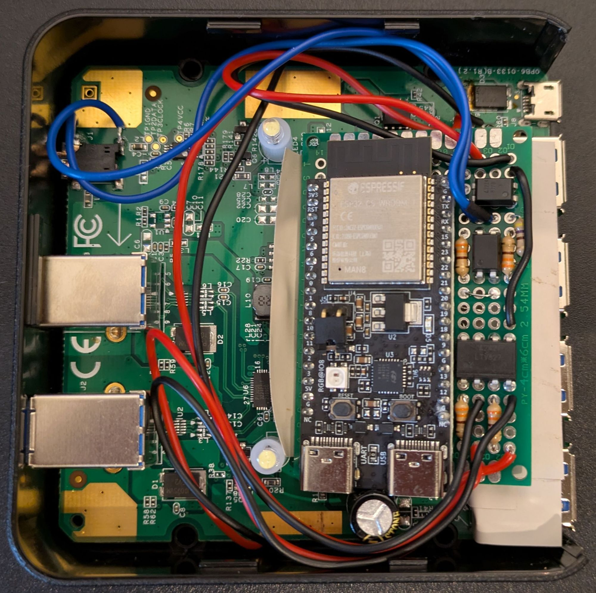
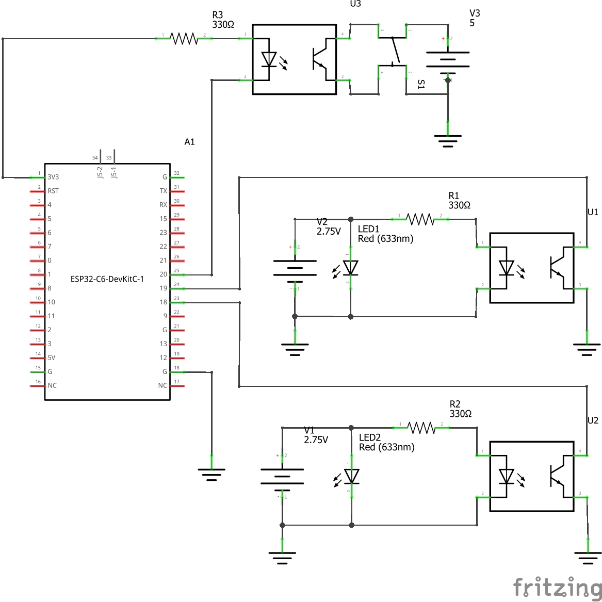
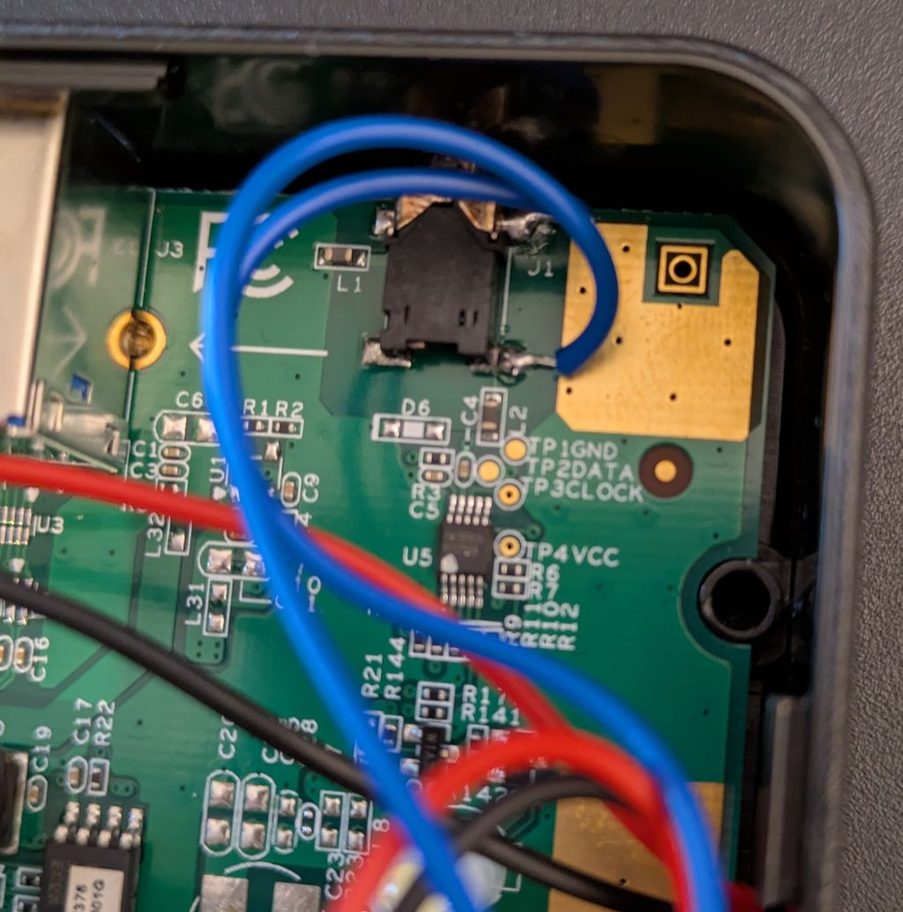
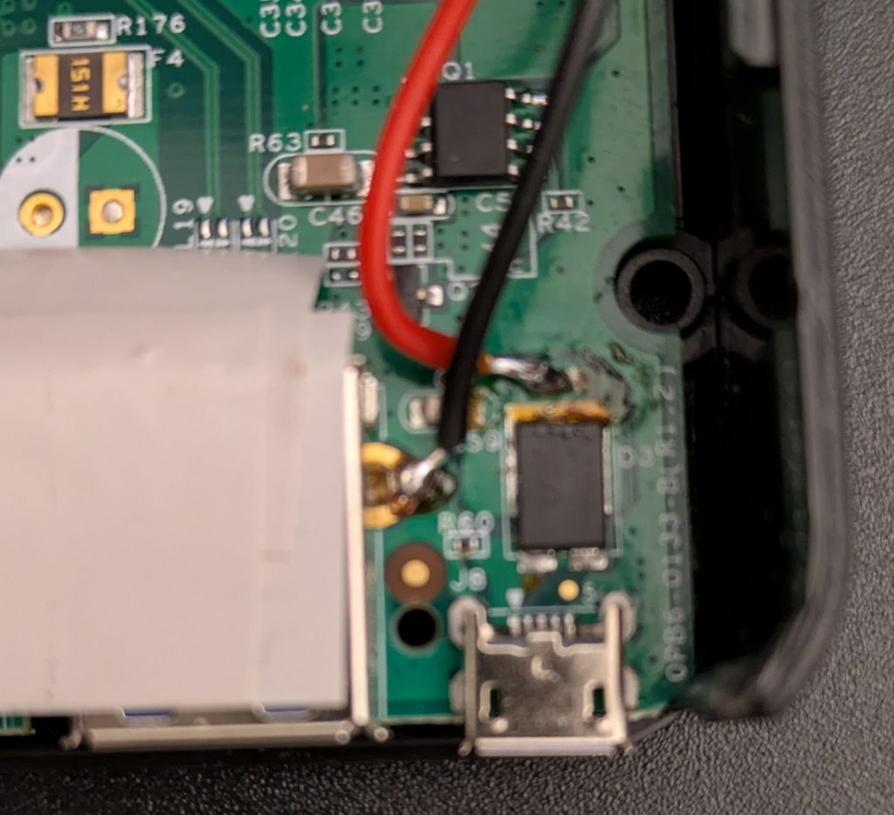

# zigbee-usb-switch

This project adds zigbee functionality to a USB-Switch.
I used an [ATEN US234](https://www.aten.com/global/en/products/usb-solutions/docks-and-switches/us234/) which you can get on amazon or wherever.
I used this device because it is spacious enough on the inside to fit all the additional components into the case. Other devices should work, but might not be as comfortable to solder and fit everything inside.

# Part List

- A USB Switch that has a toggle button and an LED for each channel. I used [this one](https://www.aten.com/global/en/products/usb-solutions/docks-and-switches/us234/)
- An [Espressif ESP32-C6 DevKitC](https://docs.espressif.com/projects/esp-dev-kits/en/latest/esp32c6/esp32-c6-devkitc-1/user_guide.html#). You can get those very cheap on AliExpress. I recommend you get at least two. One for the finished product, one for the prototyping breadboard.
- (for prototyping) a breadboard and jumper cables
- 3 optocouplers. I used one one LTV827 and one LTV817
- 3 resistors. Depending on your optocoupler and usb switch. I used 330 Ohm for everything
- PCB Board (6x4 cm / 20x14). I used the one from [this set](https://www.az-delivery.de/en/products/pcb-board-set-lochrasterplatte-platine-leiterplatte-4x4-stuck)

# Electronics



Everything fits into the original case. I clipped off everything on the back and put isolating tape wherever physical contact is possible. The two LED sockets and the condensator hold the board in place quite nicely.

## Logic wires



Here is a [Fritzing Schematic](./assets/zigbee-usb-switch.fzz).
You can get the Fritzing App [here](https://fritzing.org/) or [here](https://github.com/fritzing/fritzing-app/releases)

**Note:**
There are a couple of parts in the schematic that represent components on the USB-Switch board:

- LEDs and their corresponding power source are the actual LEDs on the usb switch pcb board. You will need to solder wires to the led pins.
- The button and its power source are in reality a 2,5mm headphone jack on the pcb board

The switch is connected like this:



Current flows from the bottom to the top contact. Make sure that the top pin is connected to the collector of the optocoupler and the lower one to the emitter.

## Power supply

My USB-Switch allows an external power source. I soldered a wire to the copper behind the voltage regulator on the switch pcb. I had to scrape off a bit of coating - seemed easiert than ruining the voltage regulator at the time (my soldering iron is really cheap). Connect the 5V wire to the 5V pin of the ESP32 devkit board.

I soldered ground to the base of one of the USB-Ports, but there are many options for ground. Connect ground to any of the G pins of the ESP32 devkit board.



# Building and Flashing

Follow the instructions provided by Espressif [see](https://github.com/espressif/esp-zigbee-sdk/tree/main/examples/esp_zigbee_HA_sample/HA_on_off_light). Personally, I use the ESP-IDF extension in VSCode. Connect a USB-C cable to the USB-port for programming and monitoring.

Using the cli tools the commands to build and flash should be:

```sh
edf.py set-target esp32c6
edf.py reconfigure
edf.py build
edf.py -P <PORT> flash
```

# Integration

If you're using zigbee2mqtt, you can use the converter I created.
Simply copy the [z2m converter file](./z2m_converter/usb-switch.js) into you data folder of your z2m installation and add the following in your configuration.yaml:

```yaml
external_converters:
  - usb-switch.js
```

When this is ever used by more than just one person, I might create a pull-request in the z2m repo for general support.
Doesn't make much sense to do so if it's just me.

# Resetting the zigbee connection

Press the toggle button 10 times in short succession.
